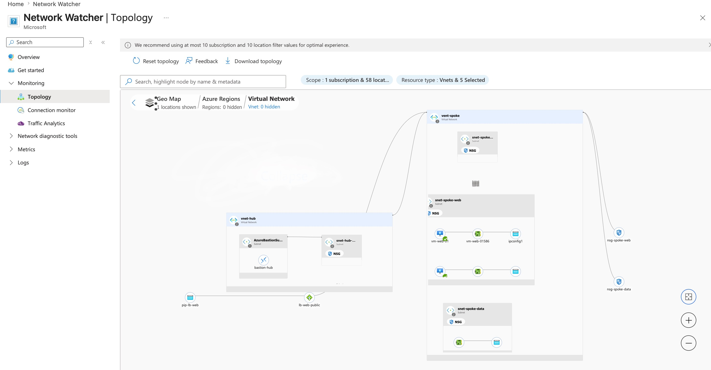
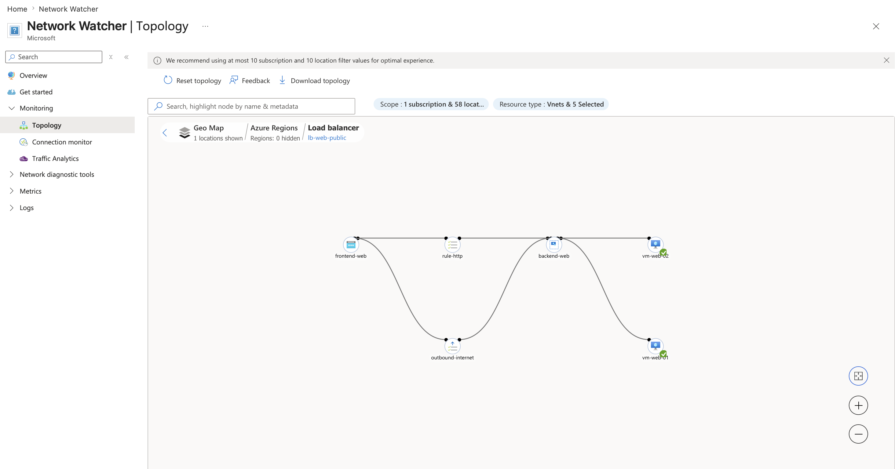
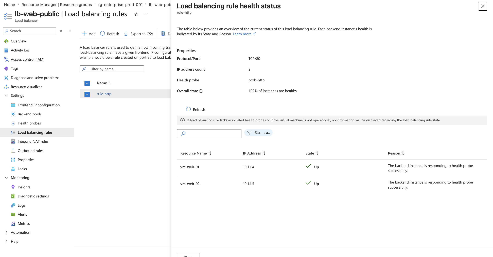
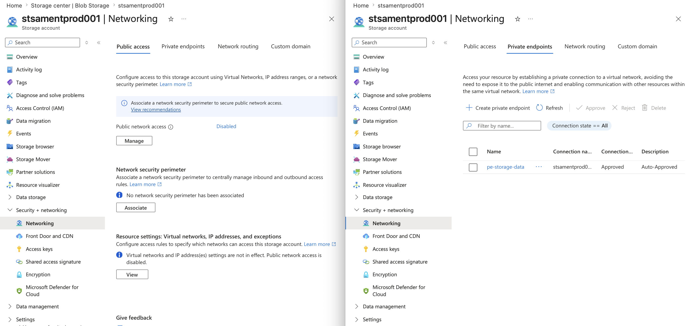
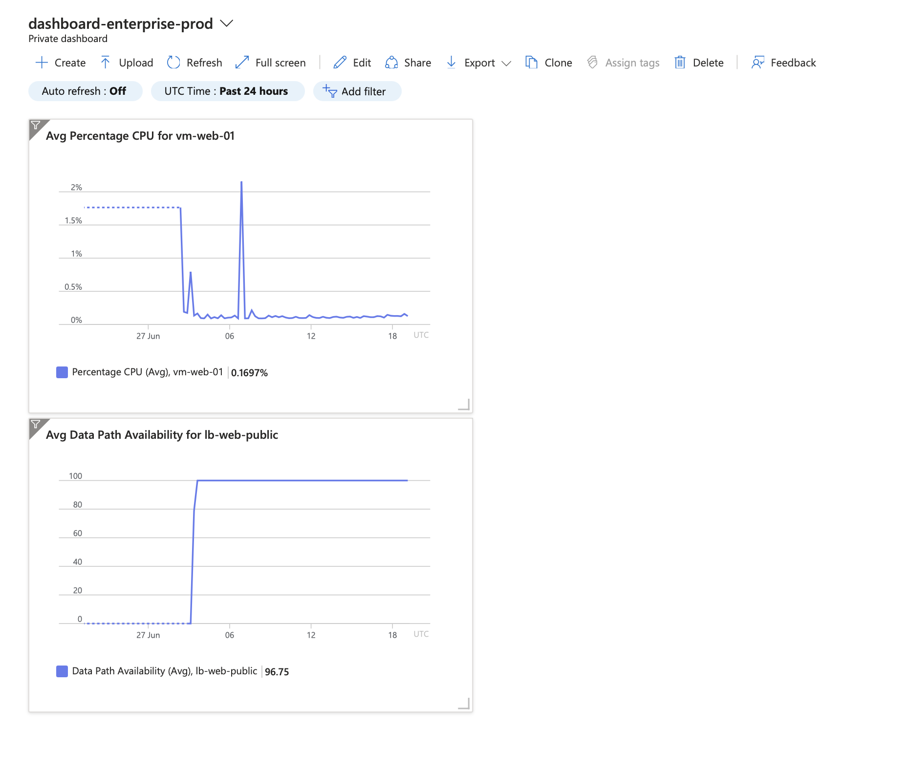

# Secure Azure Hub-and-Spoke Network Architecture

Enterprise-grade Azure infrastructure deployment featuring a secure Hub-Spoke topology, high availability, private data access, and real-time monitoring.

## Architecture Overview



## What Was Built

- **Hub VNet** (`vnet-hub`): Central management network hosting Azure Bastion for secure VM access without public IPs
- **Spoke VNet** (`vnet-spoke`): Workload network divided into three isolated subnets
- **Load Balancer**: Distributes traffic across two Ubuntu VMs running Nginx
- **Private Endpoint**: Azure Blob Storage accessible only via private IP — zero public internet exposure
- **NSGs + ASGs**: Traffic restricted by VM identity, not just IP ranges
- **Azure Monitor**: Centralized logging, CPU alert rule, and operational dashboard

## Network Design

| Resource | Value |
|---|---|
| Hub VNet | 10.0.0.0/22 |
| AzureBastionSubnet | 10.0.0.0/26 |
| snet-hub-mgmt | 10.0.1.0/24 |
| Spoke VNet | 10.1.0.0/22 |
| snet-spoke-ingress | 10.1.0.0/24 |
| snet-spoke-web | 10.1.1.0/24 |
| snet-spoke-data | 10.1.2.0/24 |

## Screenshots

### Network Topology


### Load Balancer Traffic Flow


### Load Balancer Health


### Storage Private Endpoint


### Azure Monitor Dashboard


### Live Website


## Troubleshooting Scenarios

### Scenario A: VMs cannot reach Storage
- Check Private Endpoint DNS resolves to private IP
- Verify NSG on snet-spoke-data allows traffic from asg-web-servers
- Confirm VM NIC is attached to asg-web-servers ASG

### Scenario B: Load Balancer degraded availability
- Check health probe status in Azure Monitor
- Verify Nginx is running: `sudo systemctl status nginx`
- Check NSG allows port 80 inbound from internet

## Deploy This Infrastructure

```bash
az group create --name rg-hub-spoke-network --location uksouth
az deployment group create --resource-group rg-hub-spoke-network --template-file main.bicep
```

## Certifications
- Microsoft Azure Administrator (AZ-104)
- Microsoft Azure Fundamentals (AZ-900)