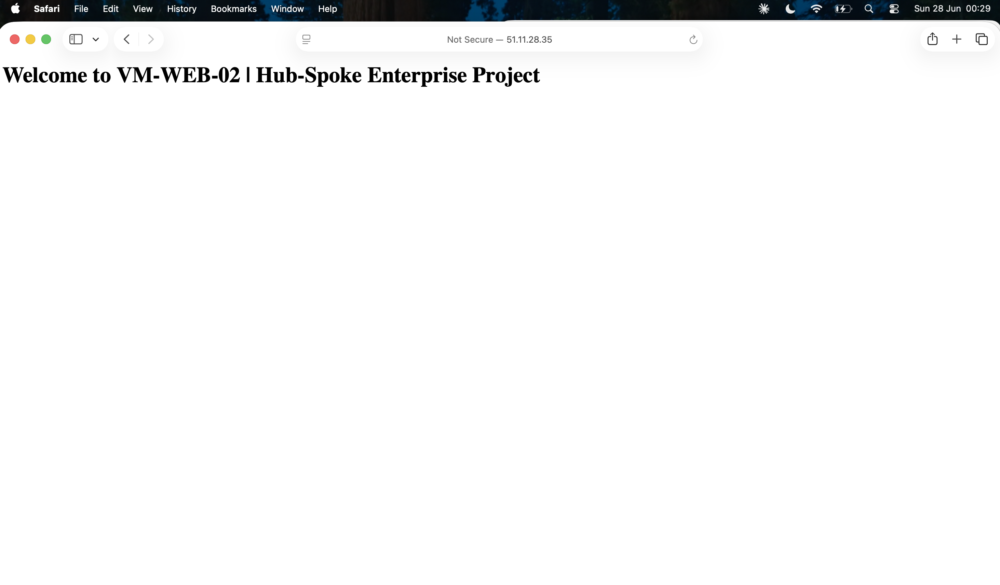

# Secure Azure Hub-and-Spoke Network Architecture

A hands-on portfolio project built alongside my AZ-104 Azure Administrator certification. The goal was to take the textbook diagram of a hub-and-spoke topology and actually deploy it — with private storage, load-balanced web tier, Bastion for admin access, and a working alert pipeline — instead of just reading about it.

## Project Status

The infrastructure was deployed end-to-end in Azure UK South, validated against the screenshots below, and then torn down to control lab costs (Bastion alone runs around £3/day, which adds up fast on a study budget). The Bicep template in this repo references foundation resources (VNets, VMs, storage, peering, the blob DNS zone) that need to exist before deployment — it provisions the security and monitoring layer on top of them. Subscription ID and the alert email address are parameterised so the repo is safe to share publicly.

## Architecture


The design uses a hub-and-spoke topology with bidirectional VNet peering. The hub holds shared services (Bastion, management); the spoke holds the workload (web tier, data tier). Splitting them this way means security controls stay centralised in the hub, and the spoke can scale or be replaced without touching anything in the hub.

## What's Deployed

| Component | Resource | Purpose |
|---|---|---|
| Hub VNet | `vnet-hub` (10.0.0.0/22) | Shared services and management |
| Spoke VNet | `vnet-spoke` (10.1.0.0/22) | Workload tier |
| Admin access | Azure Bastion | RDP/SSH with no public IPs on VMs |
| Traffic distribution | Standard Load Balancer | HTTP across two backend VMs |
| Fault tolerance | Availability Set | Hardware-level redundancy |
| Web servers | 2 × Ubuntu VMs running Nginx | Application tier |
| Data isolation | Private Endpoint (Blob Storage) | Storage traffic stays on Microsoft backbone |
| Access control | NSGs + Application Security Groups | Identity-based rules instead of IP-based |
| Monitoring | Log Analytics Workspace | Central log destination |
| Alerting | Azure Monitor metric alert | Email when VM CPU > 80% for 5 minutes |

## Subnet Layout

| VNet | Subnet | CIDR | Purpose |
|---|---|---|---|
| Hub | AzureBastionSubnet | 10.0.0.0/26 | Bastion host (Azure requires /26 minimum) |
| Hub | snet-hub-mgmt | 10.0.1.0/24 | Management resources |
| Spoke | snet-spoke-ingress | 10.1.0.0/24 | Load Balancer frontend |
| Spoke | snet-spoke-web | 10.1.1.0/24 | Web tier VMs |
| Spoke | snet-spoke-data | 10.1.2.0/24 | Private Endpoint to storage |

Peering is configured both directions with forwarded traffic enabled, so the spoke web tier can reach the storage Private Endpoint and Bastion can reach the spoke VMs.

## Design Decisions

A few choices in this build that I'd want to talk through in an interview.

**Application Security Groups over IP-based NSG rules.** The NSG on `snet-spoke-data` allows inbound traffic from the `asg-web-servers` ASG, not from the `10.1.1.0/24` CIDR. The practical difference: if I add or replace a VM in the web tier, I attach the ASG to its NIC and the rule applies automatically. No NSG edits. It scales with the workload instead of with the network plan.

**Storage account with public access disabled.** Public network access on the storage account is off entirely. The web tier reaches blob storage through a Private Endpoint that lives in `snet-spoke-data`, gets a private IP from that subnet, and resolves through the linked `privatelink.blob.core.windows.net` zone. Traffic never touches the public internet.

**Bastion in the hub, no public IPs on workload VMs.** Every admin connection goes through Bastion. No RDP or SSH ports are exposed to the internet on any VM. This eliminates the most common Azure attack surface — exposed management ports — and keeps the audit trail in one place.

## Proof of Work

Network topology:


Load Balancer traffic flow:


Backend health (both VMs healthy):


Storage account with public access disabled and Private Endpoint active:


Azure Monitor dashboard:


Load Balancer serving traffic from both backends:



## Troubleshooting Runbooks

These are the diagnostic paths I'd follow in production for the three most likely failure modes in this design. Writing them out was as useful as building the thing — it forced me to think about what would actually go wrong.

**Scenario A — Web VMs cannot reach the storage account.**
First check that the Private Endpoint DNS is resolving to the private IP from inside the VM (`nslookup stsamentprod001.blob.core.windows.net` should return a 10.1.2.x address, not a public one). If DNS is right but traffic still fails, check the NSG on `snet-spoke-data` allows inbound from the `asg-web-servers` ASG, then confirm the VM NIC is actually attached to that ASG. Network Watcher's IP Flow Verify is the fastest way to confirm which rule is permitting or blocking the traffic.

**Scenario B — Load Balancer reporting degraded Data Path Availability.**
Start at the health probe. Is it configured for TCP/80, and is Nginx actually listening on 80? SSH into a VM via Bastion and run `sudo systemctl status nginx`. If Nginx is up, check the NSG on `snet-spoke-web` allows port 80 inbound from the Load Balancer's source tag. If both look right, check the OS-level firewall — UFW on Ubuntu defaults to deny inbound, which catches people out.

**Scenario C — Cannot connect to a VM via Bastion.**
Confirm `AzureBastionSubnet` is /26 or larger (this is the most common cause). Confirm Bastion is in the same VNet as the target VM, or that peering exists between the hub and the VM's spoke. Check no NSG is blocking ports 443 or 8080 on `AzureBastionSubnet` — Bastion needs both for its session and the agent.

## Deploying It

This template assumes the foundation resources listed in the Bicep file's header already exist. To deploy the security and monitoring layer on top:

```bash
# Create or reuse the resource group
az group create --name rg-enterprise-prod-001 --location uksouth

# Deploy, passing your subscription ID and alert email
az deployment group create \
  --resource-group rg-enterprise-prod-001 \
  --template-file main.bicep \
  --parameters \
      subscriptionId=<YOUR-SUBSCRIPTION-ID> \
      alertEmail=<YOUR-EMAIL>
```

To tear down and stop spending: `az group delete --name rg-enterprise-prod-001 --yes`.

## Cost Notes

Approximate UK South pricing when this was running, for anyone building something similar:

- Azure Bastion Basic: ~£3/day — largest cost driver by far
- 2 × Standard_B2s VMs: ~£1/day combined when running
- Standard Load Balancer: ~£0.50/day plus data processing
- Storage account + Private Endpoint: pennies/day at lab volume
- Log Analytics: free under the 5 GB/month ingestion tier for labs

For longer-running labs, drop Bastion and use just-in-time VM access through Microsoft Defender for Cloud instead.

## Certifications

- Microsoft Azure Administrator Associate (AZ-104)
- Microsoft Azure Fundamentals (AZ-900)
