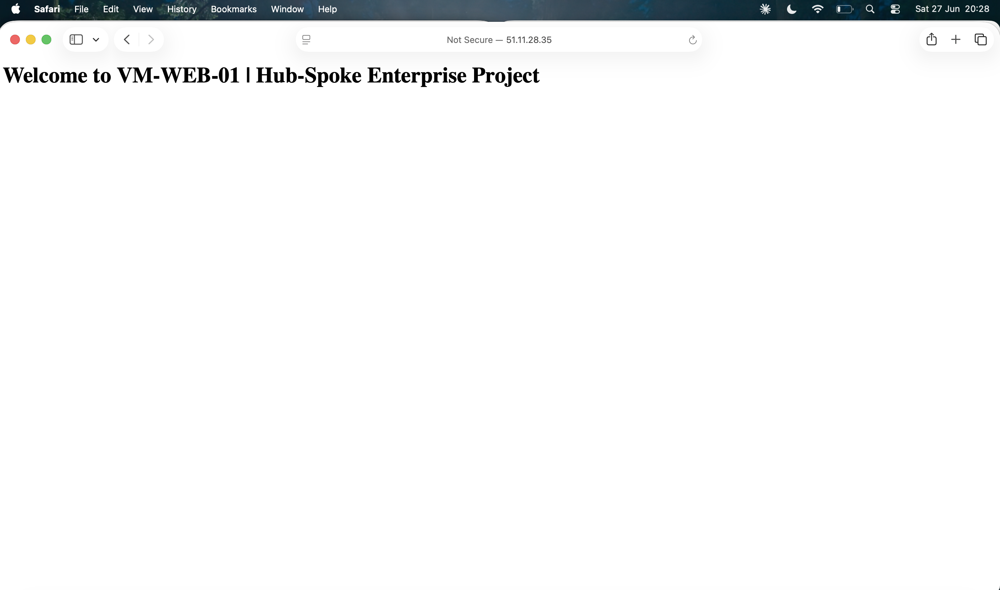

# 🏗️ Secure Azure Hub-and-Spoke Network Architecture

> Enterprise-grade Azure infrastructure deployment built and documented as a hands-on portfolio project for the AZ-104 Azure Administrator certification.

---

## 📐 Architecture Overview


This project deploys a secure, multi-tier web infrastructure using a **Hub-and-Spoke** network topology — a pattern used in real enterprise environments to enforce traffic isolation, centralise security, and enable scalable workload hosting.

---

## 🛠️ What Was Built

| Component | Resource | Purpose |
|---|---|---|
| Hub VNet | `vnet-hub` (10.0.0.0/22) | Central management network |
| Spoke VNet | `vnet-spoke` (10.1.0.0/22) | Workload environment |
| Secure Admin Access | Azure Bastion | RDP/SSH without public IPs |
| Traffic Distribution | Azure Standard Load Balancer | Distributes HTTP across 2 VMs |
| High Availability | Availability Set | Fault tolerance across hardware |
| Web Servers | 2x Ubuntu VMs running Nginx | Backend application tier |
| Data Security | Private Endpoint (Blob Storage) | Zero public internet exposure |
| Traffic Control | NSGs + Application Security Groups | Identity-based access control |
| Monitoring | Log Analytics Workspace | Centralised platform logs |
| Alerting | Azure Monitor Alert Rule | CPU > 80% triggers email |

---

## 🌐 Network Design

| VNet | Subnet | Address Space | Purpose |
|---|---|---|---|
| **Hub** | AzureBastionSubnet | 10.0.0.0/26 | Azure Bastion host |
| **Hub** | snet-hub-mgmt | 10.0.1.0/24 | Management resources |
| **Spoke** | snet-spoke-ingress | 10.1.0.0/24 | Load Balancer frontend |
| **Spoke** | snet-spoke-web | 10.1.1.0/24 | Web tier VMs |
| **Spoke** | snet-spoke-data | 10.1.2.0/24 | Private Endpoint / Storage |

> VNet Peering is configured bidirectionally between `vnet-hub` and `vnet-spoke` with forwarded traffic enabled, allowing resources in both VNets to communicate privately.

---

## 🔒 Security Design Decisions

**Why ASGs instead of IP-based NSG rules?**
Rather than allowing traffic from `10.1.1.0/24`, NSG rules on the data subnet reference `asg-web-servers` directly. This means security policies are bound to VM identity — if a new VM joins the web tier, it inherits the rules automatically by attaching the ASG. No manual rule updates required.

**Why Private Endpoint for Storage?**
Public network access is completely disabled on the storage account. All traffic travels over Microsoft's private backbone via a private IP in `snet-spoke-data` — never touching the public internet.

**Why Azure Bastion?**
No VM has a public IP address. All administrative access goes through Bastion in the Hub VNet, eliminating RDP/SSH exposure entirely.

---

## 📊 Proof of Work

### Network Topology


### Load Balancer Traffic Flow


### Backend Health — Both VMs Healthy


### Storage Account — Public Access Disabled + Private Endpoint Active


### Azure Monitor Dashboard


### Live Website — Load Balancer Serving Traffic



---

## 🔍 Troubleshooting Scenarios

### Scenario A: VMs cannot reach Storage Account
- Verify Private Endpoint DNS resolves to private IP from within the VM
- Check NSG on `snet-spoke-data` allows inbound from `asg-web-servers`
- Confirm VM NIC is attached to `asg-web-servers` ASG
- Use Network Watcher IP Flow Verify to test connectivity

### Scenario B: Load Balancer showing degraded Data Path Availability
- Check health probe status — is it TCP/80?
- SSH into VM via Bastion and run `sudo systemctl status nginx`
- Verify NSG on `snet-spoke-web` allows port 80 inbound
- Check if UFW firewall is blocking port 80 on the VM OS level

### Scenario C: Cannot connect to VM via Bastion
- Confirm `AzureBastionSubnet` is /26 or larger
- Verify Bastion is in the same VNet as the VM
- Check NSG is not blocking ports 443/8080 on AzureBastionSubnet

---

## 🚀 Deploy This Infrastructure

```bash
# Create Resource Group
az group create --name rg-hub-spoke-network --location uksouth

# Deploy Bicep Template
az deployment group create \
  --resource-group rg-hub-spoke-network \
  --template-file main.bicep
```

---

## 📜 Certifications
- Microsoft Azure Administrator (AZ-104)
- Microsoft Azure Fundamentals (AZ-900)